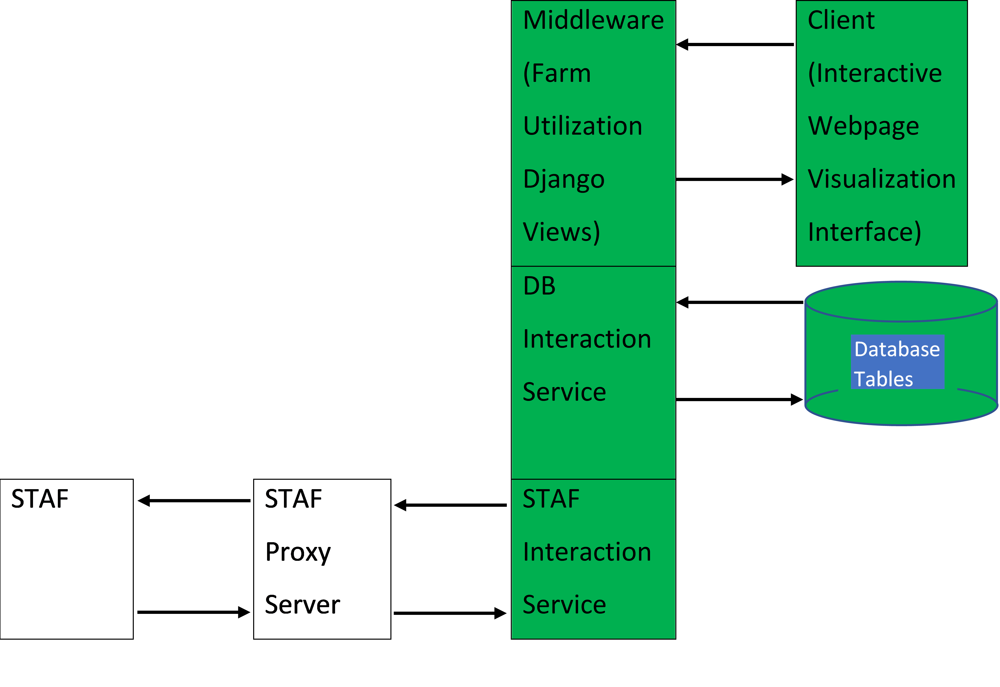

# Farm Utilization Project

The Farm Utilization Project provides visualizations of farm utilization data.

## Getting Started

### Project Functional Block Diagram

### STAF Interaction Service

Interacting with foreign services (STAF) is handled by an instance of the STAFApplicationTool & the STAFResposeConsumptionAssistant classes that are found in the ‘farm_utilization_reporting/services/’ directory.The SAT class can request data from STAF & SRCA class prepares data from STAF responses for DB consumption. 

### Database Interaction Service

Interacting with the DB is handled by an instance of the FarmUtilizationReportingAccount class. This class uses the Django ORM to accomplish this. It has a simple CRUD API to create, read, update, or delete items from the DB.

### Middleware (Farm Utilization Django Views)

All of the views are in the views.py file in the 'farm_utilization_reporting/' directory.

### Client (Interactive Webpage Visualization Interface)

All of the content that a client web-browser will render is located in the ‘farm_utilization_reporting/templates/farm_utilization_reporting/’ directory. The ‘react_library_local_use_only.html’ template is the general use template that loads the other two templates. The ‘react_library_local_use_only_table.html’ contains a single script tag with JavaScript code. This template is the entire table REACT-based component. Similar to the table, ‘react_library_local_use_only_menu.html’ is for rendering the menus for the application.

### Installing Locally

1)	Clone the repository from here
    1.	You will need at least Ubuntu 18.04, Python3.6, & Django 3.2.25 installed.
2)	Install Node package manager from by running - `sudo apt install npm`.
3)	Run `git checkout createReactTableApplication`.
4)	Run `cd my_summer_project/farm_utilization_reporting` directory.
    1.	Comment everything out in the `views.py`.
    1.	In `urls.py`, comment out all of the paths, then save.
5)	Run `cd ..`.
6)	Run `python3 -m pip install requests`. Make sure this installs version 2.32.2, at least. Older and newer versions have not been tested.
7)	Run `python3 manage.py migrate`.
1)	Run `python3 manage.py makemigrations farm_utilization_reporting`.
9)	Run `python3 manage.py migrate farm_utilization_reporting`.
10)	Run `cd my_summer_project`.
11)	In `settings.py`, erase the values in the `ALLOWED_HOSTS` variable and add the value `127.0.0.1`.
12)	Run `cd ..`.
13)	Uncomment the items commented out in 4a & 4b.
14)	You should be able to run the application from the `farm_utilization/my_summer_project/` using `python3 manage.py runserver`.
15)	In your web browser go to `127.0.0.1:8000/farm_utilization/data/`.
16)	Setting up the cronJob to update the database:
    1.	If you want to populate the database with new data you want to create a cronjob that looks like this:
        1.	*/15 * * * * wget http://127.0.0.1:8000/farm_utilization/cronPoint/ --no-proxy -O dont_care.log –quiet
    1.	Replace the `*/15 * * * *` with whatever frequency you want the DB to be updated with.

## Things That Still Need to Be Implemented
